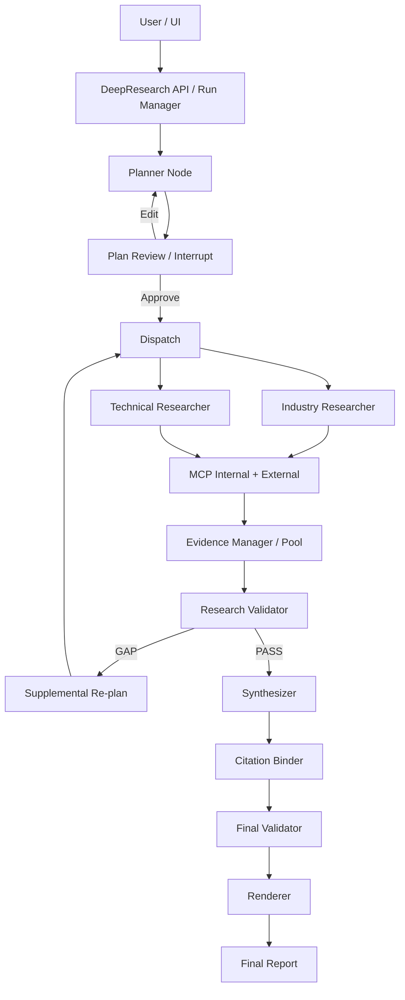

# DeepResearch 完整实现设计文档（v1.0）

**项目基线**：DeerFlow Harness + Custom Agents + Skills + 白名单 MCP  
**目标架构**：DeerFlow Agent/Skill 执行 + LangGraph 工作流编排 + Evidence/Citation 确定性服务  
**日期**：2026-09-14  
**状态**：Design Draft / Implementation Baseline

运行时升级：原生子 Agent、MCP 兼容层、普通聊天输出整理及本地 Trace 的实际设计见 [NATIVE_RUNTIME.md](NATIVE_RUNTIME.md)。以下保留最初设计，不能把可选语义 Critic 等规划项视为已实现。

> 核心原则：**Skill 管方法，LLM/Agent 管智能，LangGraph 管流程和状态，代码/服务管确定性。**

## 1. 文档目的

本文定义当前 DeepResearch 从“1 个 Lead + 2 个子 Skill”的可运行形态，演进为可控、可验证、可恢复、可扩展的生产级研究工作流。设计保留现有 MCP 白名单、内部/外部双源并行、`industry-trend` 与 `technical-route` 两个专业 Skill，不推翻现有研究能力；主要重构 Lead 后半段的职责，将 Evidence、验证、综合、引用、渲染从自由文本推理中拆出。

## 2. 当前基线与问题

当前链路：`DeepResearch Lead -> Research Graph -> SubAgent -> MCP -> Lead 检查 -> Lead 综合 -> Lead 生成最终 Markdown/引用`。

已经完成：
- `deepresearch` Lead 编排 Skill；`industry-trend` / `technical-route` 两个专业子 Skill；
- 两个 Custom Agent 在 `config.yaml` 中硬配置 system prompt、工具白名单、Skill 白名单；
- internal search 与 external search 双源并行，非失败回退；
- DeerFlow 自带 web search/fetch 禁用，强制白名单 MCP；
- `headers_from_context + on_missing: deny` 凭据注入；
- 信源优先级：注入 > 文件 > fallback，L1→L4；
- 当前 Output Contract 和证据纪律已存在。

主要痛点：最终报告质量、格式、引用位置/编号仍依赖 Lead 模型临场生成，结果易漂移；Planner 暂未形成显式可确认计划；Evidence 编号/去重/来源元数据缺少全局单一事实源；验证与补搜逻辑隐含在 Prompt 中，缺少可观测状态机和可恢复运行时。

## 3. 外部架构参考与采用原则

| 参考 | 可借鉴模式 | 本方案采用 |
|---|---|---|
| Anthropic Research | LeadResearcher + 并行 Subagents + 迭代补研 + 独立 CitationAgent；强调任务边界、输出格式、source guidance 和 effort budget | 采用 orchestrator-worker、Evidence/Citation 分层、Gap loop、预算约束 |
| OpenAI Deep Research | 研究前 proposed plan 可审核/修改；运行中可中断；最终 structured report + citations/source links | 采用 `PLAN_REVIEW` human-in-the-loop 和可恢复状态 |
| Gemini Deep Research | 协作规划；MCP/File Search；显式工具限制 | 保留白名单 MCP，将 source strategy 纳入 ResearchPlan |
| LangGraph | interrupt + checkpoint + resume；状态持久化、故障恢复 | 作为 V2 控制流核心 |
| GPT Researcher | Reviewer/Reviser/Writer/Publisher 职责分离 | 不复制多 Agent 数量，只吸收 Validator、Synthesizer、Renderer 分层 |
| DeepResearch Bench | 报告质量（RACE）与引用可信度/有效引用（FACT）分开评估 | 形成报告质量 + Citation 双轨 Eval |

## 4. 设计目标与非目标

### 4.1 目标
1. Planner 输出显式 `ResearchPlan`，必须支持用户查看、编辑、确认后开始研究。
2. Researcher 专注“研究 + 证据”，不直接产最终报告。
3. 所有 Evidence 进入全局 Evidence Pool，由后端统一 ID、去重、元数据与审计。
4. Validator 形成确定性的 PASS/GAP 决策，GAP 只补缺口，不全量重跑。
5. Synthesizer 输出结构化 Claim/Segment + `evidence_ids`，而不是自由 Markdown。
6. Citation Binder 与 Renderer 代码化，保证引用编号、位置、References 稳定。
7. LangGraph 管理工作流、状态、interrupt、checkpoint、retry/resume。
8. 保留现有 DeerFlow Custom Agent、Skill 和 MCP 机制，实现渐进式迁移。

### 4.2 非目标
- 不把每个节点都做成 Agent。
- 不重写现有 MCP 检索与认证机制。
- 不要求一开始支持任意数量的专业 Skill；先稳定两个核心 Skill。
- 不依赖模型保证 Markdown 格式、引用编号或数据库一致性。

## 5. 总体架构



### 5.1 五类节点定义
- **Agent**：拥有模型、system prompt、独立上下文、工具和 Skill 的智能执行体。
- **Skill**：可复用研究方法论/流程说明/参考资源，不是运行时状态节点。
- **Graph/Workflow Node**：LangGraph 中负责路由、状态推进、条件分支、并发、interrupt 的控制节点。
- **State Object**：`ResearchState`、`ResearchPlan`、`ResearchResult`、`EvidencePool` 等数据对象。
- **Code/Service**：Evidence Manager、Citation Binder、Renderer、DB/Checkpointer 等确定性组件。

## 6. 模块职责矩阵

| 模块 | 类型 | 主要驱动 | 输入 | 输出 | 是否 LLM |
|---|---|---|---|---|---|
| Planner | Agent + Graph Node | 模型 + deepresearch Skill | 用户目标/约束 | ResearchPlan | 是 |
| Plan Review | Graph Node + Human | LangGraph interrupt | ResearchPlan | approve/edit/reject | 否 |
| Dispatch | Graph Node | 代码 | pending ResearchUnit | agent calls | 否 |
| Industry Researcher | Agent | 模型 + industry-trend Skill | objective/source strategy | ResearchResult | 是 |
| Technical Researcher | Agent | 模型 + technical-route Skill | objective/source strategy | ResearchResult | 是 |
| Evidence Manager | Code/Service | 规则/代码 | raw evidence | EvidencePool | 否 |
| Research Validator | Graph Node | 规则 + 可选 LLM Critic | plan/findings/evidence | PASS/GAP | 混合 |
| Synthesizer | Agent | 模型 + report-synthesis Skill | findings/evidence | StructuredReport | 是 |
| Citation Binder | Code/Service | 规则/代码 | StructuredReport/Evidence | citation map | 否 |
| Final Validator | Code/Service + 可选 LLM | schema/coverage/citation | bound report | PASS/local fix | 混合 |
| Renderer | Code/Service | 模板 | report AST | Markdown/HTML/DOCX | 否 |
| Checkpointer/DB | Code/Service | 持久化 | ResearchState | snapshots/audit | 否 |

## 7. 端到端运行时链路

### 7.1 创建 Run
`POST /deepresearch` 创建 `run_id`、`thread_id`、权限上下文和初始 ResearchState，状态 `CREATED -> PLANNING`。

### 7.2 Planner 与用户确认
Planner 读取用户目标、约束、期望产物、数据源偏好，并按 DeepResearch Skill 生成 `ResearchPlan`。计划至少包含 ResearchUnit、Skill、objective、priority、source_strategy、依赖与预算。生成后 Graph 进入 `AWAITING_PLAN_CONFIRMATION` 并 interrupt。

用户可：
- Approve：继续研究；
- Edit：修改研究角度、优先级、来源；重新进入 Planner 规范化；
- Reject：结束或回到澄清。

### 7.3 Dispatch 与并行 Researcher
Dispatch 读取 `PENDING` 的 ResearchUnit，以 Skill/agent_type 路由到现有 DeerFlow Custom Agent。LangGraph 已经做出路由决定时，不再让 Lead LLM 二次决定 `task()`，避免增加不确定性。

### 7.4 双源检索
每个 Researcher 必须通过白名单 MCP 执行 internal 与 external 两路检索，二者是互补并行关系而不是 fallback。source strategy 继续使用现有“注入 > 文件 > 内置 fallback”和 L1→L4 优先级；敏感认证信息仅从运行时 context 注入，缺失则 deny。

### 7.5 ResearchResult 与 Evidence Manager
SubAgent 返回结构化 `ResearchResult`，包括 Findings、Raw Evidences、Open Questions、Confidence。禁止 SubAgent 自行产生最终引用编号。Evidence Manager 对 raw evidence 做 URL canonicalization、内容 hash、去重、来源分类、发布日期、origin、source level，并生成全局 `E001...`。

### 7.6 Validator 与 GAP Loop
Validator 分为规则层和语义层：
- 规则层：Schema、双源覆盖、Evidence 数量、日期、source level、claim coverage、关键结论双源交叉验证、无效 URL 等；
- 语义层（可选 LLM Critic）：是否遗漏用户目标、Evidence 是否真正支持 Claim、是否存在冲突、需要补什么。

输出 `PASS` 或 `GAP[]`。GAP 转为 Supplemental ResearchUnit，标记 `parent_gap_id`，只做定向补研；达到停止条件后进入人工/降级路径，禁止无限循环。

### 7.7 Synthesizer
Synthesizer 不输出最终 Markdown，而是输出 Claim/Segment 级 `StructuredReport`：每个事实段落明确绑定 `evidence_ids`。这是支持句中/段中 `[1]` 引用的关键。

### 7.8 Citation Binder 与 Renderer
Citation Binder 按证据首次出现顺序建立稳定编号，同一 Evidence 在全文复用同一 citation number，不允许模型修改 URL/标题。Renderer 将 AST 渲染为 Markdown/HTML/DOCX；前端可根据 citation metadata 渲染可点击来源卡片。

## 8. 状态机

`CREATED -> PLANNING -> AWAITING_PLAN_CONFIRMATION -> RESEARCHING -> VALIDATING -> (GAP_FOUND -> RESEARCHING)* -> RESEARCH_COMPLETE -> SYNTHESIZING -> CITATION_BINDING -> FINAL_VALIDATING -> RENDERING -> COMPLETED`。

任一可失败节点进入 `FAILED`；基于 checkpoint 从最近成功节点恢复，而不是从头重跑。

## 9. 核心 Contract

### 9.1 ResearchPlan
```python
class ResearchPlan(BaseModel):
    goal: str
    research_units: list[ResearchUnit]
    constraints: list[str] = []
    expected_output: str
    plan_version: int = 1

class ResearchUnit(BaseModel):
    id: str
    skill: Literal["industry-trend", "technical-route", "general-research"]
    objective: str
    priority: int
    source_strategy: SourceStrategy
    depends_on: list[str] = []
    parent_gap_id: str | None = None
```

### 9.2 ResearchResult
```python
class ResearchResult(BaseModel):
    unit_id: str
    findings: list[Finding]
    raw_evidences: list[RawEvidence]
    open_questions: list[str] = []
    confidence: float

class Finding(BaseModel):
    claim: str
    raw_evidence_refs: list[str]
    confidence: float
```

### 9.3 Evidence
```python
class Evidence(BaseModel):
    evidence_id: str
    canonical_url: str | None
    title: str
    origin: Literal["internal", "external"]
    source_level: Literal["L1", "L2", "L3", "L4"]
    published_at: datetime | None
    snippet: str
    content_hash: str
    unit_ids: list[str]
    raw_content_ref: str | None
```

### 9.4 StructuredReport
```python
class StructuredReport(BaseModel):
    title: str
    executive_summary: list[Segment]
    sections: list[ReportSection]
    conclusion: list[Segment]

class Segment(BaseModel):
    text: str
    evidence_ids: list[str]
    segment_type: Literal["fact", "analysis", "recommendation"]
```

## 10. ResearchState 与 LangGraph

```python
class ResearchState(TypedDict):
    run_id: str
    thread_id: str
    query: str
    status: RunStatus
    plan: ResearchPlan | None
    research_units: dict[str, ResearchUnitState]
    findings: list[Finding]
    evidence_pool: dict[str, Evidence]
    gaps: list[ResearchGap]
    structured_report: StructuredReport | None
    citation_map: dict[str, int]
    rendered_report: str | None
    iteration: int
    budget: ResearchBudget
```

建议 Graph：
```python
START -> planner -> plan_review
plan_review --approve--> dispatch
plan_review --edit--> planner
dispatch -> research_subgraphs -> evidence_merge -> validator
validator --gap--> supplemental_plan -> dispatch
validator --pass--> synthesizer -> citation_binder -> final_validator
final_validator --pass--> renderer -> END
final_validator --local_fix--> synthesizer
```

## 11. Agent 与 Skill 边界

### 11.1 Planner Agent
System Prompt 只定义角色、边界与输出 Contract；详细研究拆解方法在 `deepresearch/SKILL.md`。Planner 不直接检索。

### 11.2 Industry Researcher
沿用现有 Custom Agent：工具白名单 + `industry-trend` Skill + 强制双源 MCP。Agent 只返回 ResearchResult，不写最终报告。

### 11.3 Technical Researcher
沿用现有 Custom Agent：工具白名单 + `technical-route` Skill + 强制双源 MCP。需要时同一 Agent 可执行多个独立 ResearchUnit。

### 11.4 Synthesizer Agent
新增 `research-synthesizer` Agent 与 `report-synthesis` Skill。该 Agent 默认无搜索工具，避免在写作阶段偷偷引入未进入 Evidence Pool 的新事实。

## 12. Evidence 管理

Evidence Manager 是确定性服务，不是 Agent。建议规则：
- URL canonicalization：去 tracking query、fragment，保留业务必要参数；
- `content_hash` 去重；同源重复内容合并 unit_ids；
- 内部文档无公开 URL 时允许 `source_uri/document_id`；
- Evidence ID 仅由后端生成；
- `raw_content_ref` 指向对象存储/缓存，数据库保存摘要和元数据；
- 支持 Evidence lineage：raw source -> evidence -> finding -> segment -> citation。

## 13. Validator 设计

建议分 3 层：
1. **StructuralValidator（代码）**：Schema、必填字段、双源、日期、空链接、Evidence ID、单位状态。
2. **CoverageValidator（代码 + 规则）**：ResearchPlan 中每个 objective 是否有 findings/evidence；关键 Claim 是否至少 1 个 Evidence；高风险 Claim 可要求 2 个独立来源。
3. **SemanticCritic（LLM，可选）**：是否遗漏、证据是否支撑、是否存在冲突、是否需要新的角度。

停止条件建议：`max_iterations`、`max_units`、`max_tool_calls`、时间/Token Budget、重复 Gap、Evidence saturation。触发后可以“带限制 PASS”或请求用户追加范围，不允许无限补研。

## 14. Citation 设计

引用不由模型直接输出 `[1]`。Synthesizer 只输出 `evidence_ids`，Citation Binder 负责编号与定位。

示例：
```json
{
  "segments": [
    {"text": "大型代码平台普遍采用分片式存储。", "evidence_ids": ["E003", "E008"]},
    {"text": "对象存储承担冷数据与大对象。", "evidence_ids": ["E011"]}
  ]
}
```
渲染：`大型代码平台普遍采用分片式存储。[1][2] 对象存储承担冷数据与大对象。[3]`

前端收到 citation metadata 后可以把 `[1]` 渲染为 clickable component，点击显示 title/source/snippet/url/internal document locator。

## 15. API 与事件流

建议接口：
- `POST /deepresearch`：创建 run；
- `GET /deepresearch/{run_id}`：查询整体状态；
- `POST /deepresearch/{run_id}/plan/approve`；
- `POST /deepresearch/{run_id}/plan/edit`；
- `POST /deepresearch/{run_id}/cancel`；
- `GET /deepresearch/{run_id}/events`：SSE/WebSocket；
- `GET /deepresearch/{run_id}/report`；
- `GET /deepresearch/{run_id}/evidences`：调试/审计权限下可见。

事件：`run.created`、`plan.created`、`plan.waiting_confirmation`、`plan.updated`、`research.unit.started`、`research.unit.completed`、`evidence.pool.updated`、`validator.gap_found`、`validator.passed`、`report.synthesizing`、`citation.bound`、`report.completed`、`run.failed`。

## 16. 持久化模型

核心表：`research_run`、`research_unit`、`research_evidence`、`research_gap`、`research_report`、`research_event`。LangGraph checkpointer 保存可恢复 Graph State；业务数据库保存可检索的 Run/Evidence/Report；大体量原文进入对象存储。

## 17. 可靠性与幂等

- 每个 Graph Node 以 `run_id + node + version/attempt` 建幂等键；
- MCP 查询失败仅重试对应 tool call，不重跑已完成 unit；
- Evidence merge 使用 canonical URL + content hash 幂等；
- Synthesizer/Renderer 产物带 version；
- `interrupt` 前的副作用必须幂等；
- checkpoint 后恢复时不重新执行同一批已成功 ResearchUnit。

## 18. 并发、预算与停止策略

ResearchUnit 可并发，初期建议限制 2-4 个并发；同一 Researcher 内部工具调用可并行但受 MCP/下游限流约束。预算对象至少包括 `max_iterations/max_units/max_tool_calls/max_elapsed_seconds/max_model_tokens`。Planner 根据任务复杂度分配预算，Validator 根据剩余预算决定补研深度。

## 19. 可观测性

所有调用统一携带 `trace_id/run_id/thread_id/unit_id/agent_name/skill_name/tool_name/source_origin`。关键指标：plan 修改次数、unit 数、MCP 成功率/延迟、internal/external 覆盖、Evidence 数/去重率、关键 Claim coverage、Gap 次数、重试次数、LLM tokens、总时延、citation accuracy、final validator pass rate。

## 20. Eval 与质量门禁

采用两类评估：
- **报告质量**：Completeness、Depth、Instruction Following、Readability、Decision Usefulness；
- **证据与引用**：Factual Accuracy、Citation Accuracy、Citation Coverage、Effective Citation Count、Source Quality、Source Diversity；
- **过程效率**：Tool Efficiency、重复搜索率、ResearchUnit 重叠度、预算超限率。

建议最小测试集先做 20-30 个真实研发效能/开发者平台问题，每次 Prompt/Skill/Graph 改动必须跑回归。

## 21. 安全与权限

- MCP 凭据继续通过 context 注入，`on_missing: deny`；
- 禁止将 Cookie/CSRF/Token 写入 prompt、event payload、trace 明文；
- Synthesizer 默认无 MCP 权限；
- Evidence/Report 的内部来源必须继承用户 ACL，前端引用卡片不能越权；
- 白名单控制只针对“搜索/获取内容”工具，不误伤 DeerFlow 必需的通用运行工具。

## 22. 建议代码目录

```text
backend/
  deepresearch/
    graph/
      state.py
      workflow.py
      nodes/
        planner.py
        plan_review.py
        dispatch.py
        evidence_merge.py
        validator.py
        supplemental_plan.py
        synthesis.py
        final_validate.py
        render.py
    contracts/
      research_plan.py
      research_result.py
      evidence.py
      report.py
      events.py
    services/
      agent_runner.py
      evidence_manager.py
      citation_binder.py
      renderer.py
      source_policy.py
      research_store.py
    validators/
      structural.py
      coverage.py
      semantic_critic.py
    api/
      routes.py
      stream.py
    evals/
      cases.json
      judge.py
      metrics.py

skills/custom/
  deepresearch/SKILL.md
  deepresearch-suite/
    industry-trend/SKILL.md
    technical-route/SKILL.md
    report-synthesis/SKILL.md

agents/
  planner/config.yaml
  industry-researcher/config.yaml
  technical-researcher/config.yaml
  research-synthesizer/config.yaml
```

## 23. 分阶段实施

### Phase 0：基线确认
先完成现有 `/deepresearch` E2E，确认 internal/external 双源、MCP 白名单、认证透传、2 个 SubAgent Output Contract 正常；保存一批 baseline 报告。

### Phase 1：稳定“数据流”，暂不迁 Graph
定义 4 个核心 Contract；SubAgent 改为返回 ResearchResult；新增 Evidence Manager/Pool；新增 Synthesizer + StructuredReport；Citation Binder/Renderer 代码化。此阶段仍可由现有 DeerFlow Lead 触发。

### Phase 2：稳定“控制流”
引入 LangGraph：Planner -> Plan Review -> Dispatch -> Validate -> Gap Loop -> Synthesis；接 checkpointer，实现 interrupt/resume、节点级重试和状态事件流。

### Phase 3：生产增强
增加多 Skill、动态复杂度预算、异步批任务、对象存储、审计、Eval CI、灰度/版本化 Prompt 与 Skill。

## 24. 验收标准（建议）

机制类（硬门禁）：
- ResearchPlan/ResearchResult/Evidence/StructuredReport Schema parse 成功率 100%；
- 无不存在的 citation id；同一 Evidence 编号全文一致；URL 不被模型重写；
- 适用任务 internal + external 双源覆盖率 100%；
- Planner 能停在确认态并在 edit/approve 后用同一 run/thread 恢复；
- 单个 SubAgent/MCP 失败可从 checkpoint 局部恢复；
- Renderer 输出固定格式，重复输入得到相同引用编号和结构。

质量类（初始目标，需用 baseline 校准）：Citation Accuracy ≥ 0.90、关键 Claim Citation Coverage ≥ 0.95、用户要求维度 Coverage ≥ 0.90、L1/L2 高质量来源占比达到当前业务定义阈值。

## 25. 关键设计决策（ADR 摘要）

1. **不把每个节点做成 Agent**：只有需要独立模型上下文、工具或 Skill 边界的节点才建 Agent。
2. **Evidence ID 后端唯一生成**：SubAgent 不拥有最终编号权。
3. **Synthesizer 不直接生成最终 Markdown**：先生成结构化 AST，再由 Renderer 输出。
4. **Citation 以 Segment/Claim 为最小绑定粒度**：支持句中/段中引用和前端来源卡片。
5. **LangGraph 后置迁移**：先稳定 Contract/Data Flow，再迁移 Control Flow。
6. **专业 Skill 保留并扩展**：当前 industry/technical 不动，未来产品基准/客户案例/落地规划可新增 Skill，而不是扩大一个超级 Prompt。

## 26. 风险与待决问题

- Planner 是否独立 Custom Agent，还是复用 DeerFlow Lead 的模型实例；建议逻辑角色独立，物理模型可复用。
- Citation 的“证据选择”由 Synthesizer 一次完成还是再加 Citation Critic；V1 由 Synthesizer 输出 evidence_ids + 规则 Binder，质量不足再增加 Critic。
- Evidence 原文存储的版权、大小和内部 ACL 方案；建议对象存储引用而非数据库全量复制。
- 当前两个 Skill 的 Output Contract 与新 ResearchResult 的字段如何映射；优先做 adapter，避免一次改动太大。
- LangGraph 与 DeerFlow 已有 runtime/checkpointer 的边界需以你们 fork 的实际包结构落地，避免重复持久化。

## 27. 完整运行示例（CodeHub）

用户：研究 CodeHub 海量代码仓库存储与检索未来趋势。

1. Planner 生成 R1 行业趋势、R2 存储技术路线、R3 语义检索三个 ResearchUnit；状态进入 `AWAITING_PLAN_CONFIRMATION`。
2. 用户新增“GitHub/GitLab 工程实践单列”，Planner 更新计划并确认。
3. Dispatch 并行调用 Industry Researcher 与 Technical Researcher；两者分别通过 internal/external MCP 检索。
4. SubAgent 返回 Findings + Raw Evidence；Evidence Manager 形成 E001-E026。
5. Validator 发现“容量上限”缺少量化证据，产生 G1 并创建 R4，仅研究公开规模/容量/分片上限。
6. R4 新增 E027-E030，Validator PASS。
7. Synthesizer 输出章节和 Segment，每个 Segment 绑定 Evidence ID。
8. Citation Binder 按首次出现顺序映射 E003->[1]、E008->[2]；Renderer 得到句子级引用。
9. Final Validator 检查无孤立引用、无未引用关键事实、章节覆盖满足计划；输出 Final Report。

## 28. 参考资料

1. DeerFlow 2.0 README / Documentation - Harness、Skills、Sub-agents、LangGraph runtime。https://github.com/bytedance/deer-flow
2. DeerFlow config.example.yaml - Custom Agent 的 system_prompt、tools、skills、model、max_turns/timeout。https://github.com/bytedance/deer-flow/blob/main/config.example.yaml
3. DeerFlow Customization - 自定义 Skill 与 LangGraph-compatible checkpointer。https://github.com/bytedance/deer-flow/blob/main/frontend/src/content/zh/harness/customization.mdx
4. Anthropic, “How we built our multi-agent research system”, 2025-06-13。https://www.anthropic.com/engineering/multi-agent-research-system
5. OpenAI, “Deep research in ChatGPT” - proposed plan review/edit、interrupt、structured report with citations。https://help.openai.com/en/articles/10500283-deep-research
6. Google AI, “Gemini Deep Research agent” - collaborative planning、MCP/File Search/tool restrictions。https://ai.google.dev/gemini-api/docs/deep-research
7. LangGraph, Interrupts / Persistence / Human-in-the-loop。https://docs.langchain.com/oss/python/langgraph/interrupts
8. LangChain Open Deep Research - supervisor、ConductResearch、ResearchComplete、研究迭代/并发限制。https://github.com/langchain-ai/open_deep_research
9. GPT Researcher Multi-Agent System - Chief Editor/Researcher/Reviewer/Reviser/Writer/Publisher。https://github.com/assafelovic/gpt-researcher
10. DeepResearch Bench - RACE/FACT 深度研究质量与引用评估。https://deepresearch-bench.github.io/
