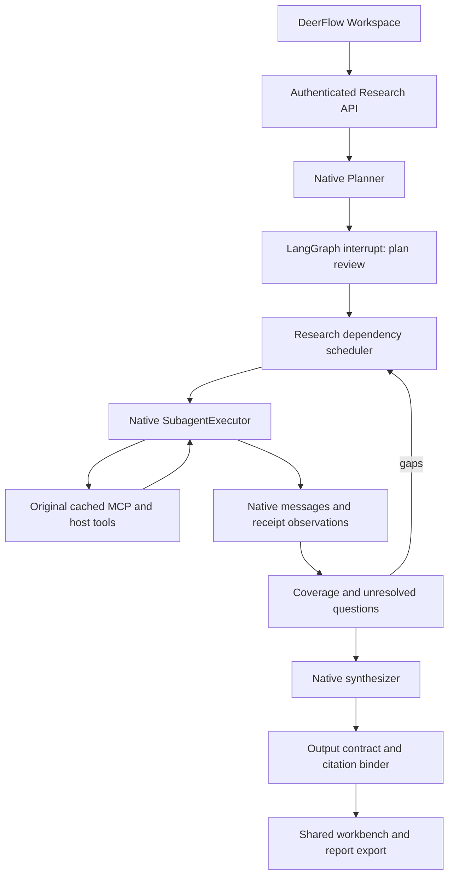

# DeepResearch 设计说明：原生执行与研究编排

## 原因与分层

最初实现读取 Custom Agent 配置后自行创建仅含计量中间件的图。独立图和 Agent 名称并不等于原生运行能力：状态初始化、权限、Skill 激活、沙箱租约、系统消息合并、压缩、循环保护、取消和 receipts 都由原生执行器提供。另一方面，强制预搜索、query-only 包装与 MCP 结果映射把研究模块变成了另一套工具运行器。

现在分层如下：

## 各层所有权

宿主负责模型工厂、MCP cache/session pool、工具原始 schema、认证 interceptor、原生 Agent 中间件。工作流负责研究目标、计划版本、依赖与补研次数、研究数据和报告。

`native.py` 通过公开的 `execute_async`、查询、取消、清理接口委托 `SubagentExecutor`。唯一新增宿主接口是可选 `request_secrets` 和 `execution_callbacks`：不接收任意 context，不覆盖身份、沙箱 owner 或授权字段。回调只使用无事件循环绑定的存储操作。

每个研究角色有专属 `execution_id` 和 `dr-<run>-<unit-or-role>` 线程范围；保留子 Agent 的单次执行语义。原生状态与中间件完全由宿主构建。`native_tools` 只是可选额外限制；Agent 与激活 Skill 的授权仍为最终边界。

## MCP 不需要统一返回格式

`runner._source_tools` 从宿主缓存选择原始工具，通过宿主 MCP source metadata 确认服务身份。原对象进入执行器，其名称、描述、参数 schema、返回内容块、artifact、传输和 interceptor 不被重写。

不再：要求 `results/title/url/snippet`、把工具包装成 `query`、强制先检索两路、为每个响应设计 adapter、自动重放任意工具调用。旧 `fields/results_path/query_arg/fixed_args/response_mode` 只为读取旧配置保留，已无执行效果。

模型通过正常工具循环决定检索/阅读/追加调用。调用失败由原生工具错误机制反馈给模型；是否重试由研究执行和预算控制。

## 证据与校验

`observations.py` 在 Agent **完成之后**读取宿主捕获的 ToolMessage 与 receipts，按真实 call ID 建立跨研究单元的引用目录。只检查宿主消息信封，不解释 MCP 业务结构。返回内容本体可为任意文本、对象或内容块。

文档型来源和调用型来源不能混淆。原生调用引用标记 `provenance=tool_output`，MCP 调用使用 `mcp-result://` 定位；文件、沙箱等原生工具使用 `tool-result://` 和 `origin=runtime`，同样可引用，但不会充当已配置的 internal/external MCP。二者均不制造 URL 或发布日期。原生 receipt `[r1]` 与 call ID 会作为别名提供给输出整理器；最终报告编号由代码统一。

校验器检查目标覆盖、真实引用 ID 和配置来源覆盖。Researcher 的 `open_questions` 和原生运行 cap 会进入定向补研，后续补研可解决原目标的问题。针对 opaque 调用不要求发布日期字段；高风险的机械检查仅确认跨配置来源记录。报告明确说明这不是原文独立性或语义支持证明。

## 普通聊天模型

所有角色通过原生 Agent 运行；输出可以是普通文字。研究自身需要的 Plan/Analysis/Report 契约只在输出边界整理。支持已有 JSON、fenced JSON 和 fenced YAML；否则用普通 chat messages 请求转换并有限修复，不发送 `response_format` 或 `with_structured_output`。

`extraction_model` 可指定另一个已配置模型；`output_retries` 限制整理次数。没有 JSON mode 的模型仍需有基本的结构化文字生成能力；原生工具研究要求工具调用能力。这两个能力不是一回事。

## 恢复与生命周期

LangGraph checkpoint 控制 interrupt/resume。研究业务库记录计划、报告、事件和完成单元。完整原生执行结果先缓存，转换失败可复用；中途失败则重新执行该单元，不伪造逐工具 exactly-once。

配置/Skill 指纹变化时拒绝恢复旧任务。时间累计不包含审批等待，恢复不重置预算。单进程锁拒绝多个 worker 共享本地研究目录；多实例迁移要显式设计共享持久化与执行租约。

## 前端和观测

工作区复用 Sidebar、WorkspaceContainer/Header/Body、宿主 fetcher 和主题；表单使用 Button/Input/Textarea，来源抽屉使用现有 Sheet，继承键盘、焦点和动画行为。研究计划、报告引用和 Trace 展示是领域组件。

本地 span 和轮转日志依赖原生模型/工具回调。Trace 按 run owner/ACL 查询与导出，默认载荷限长脱敏；运营日志只记运行元数据。详见 README 和 API 文档。没有 LangSmith 服务依赖。

## 保留的领域能力及限制

没有把研究业务表直接写进聊天消息库：审批版本、跨单元证据与报告导出是不同契约。研究 API 使用宿主 principal，执行使用原生子 Agent，而 Lead-only 记忆写入、Gateway 聊天历史和上传不在本次范围。逐层评审见 REUSE_AUDIT.md。
