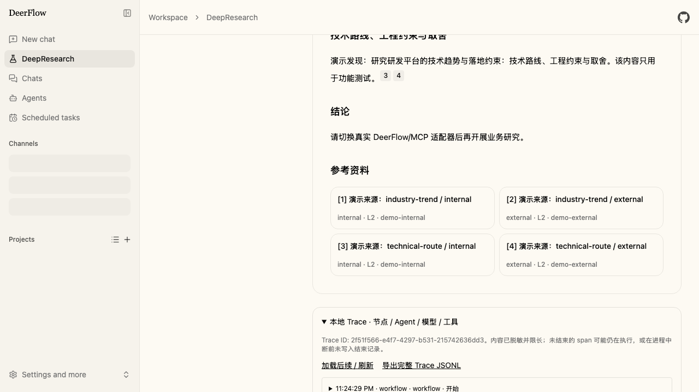
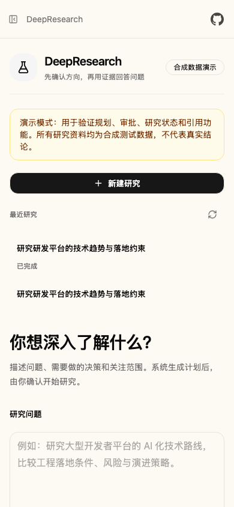

# 验收记录

## 当前真实集成验证（2026-09-16，未完成最终验收）

后续无模型调用的 UI 验收已补齐：15 项前端回归通过；computer use 验证了合成环境
的编辑/自动启动、追问与改写不重复搜索、历史版本下载、Trace 导出、移动端引用返回，
以及扩展缺失时 Enter 不会提交。完整 lint/typecheck 通过。详细范围仍以当天记录为准，
不能替代真实研究报告与最终 CI。

原生 Gateway、DeepSeek、原生搜索/抓取、普通对话和 Skill 文件读取已实际运行。
四次真实研究仍在最终报告前触及预算，不能宣称完整研究通过。根据 trace 修正了
图递归上限、预算计量、原生工具缺失，并离线补齐预算预警与重复上下文削减。
最新为 197 项后端回归、7 项前端测试通过；完整真实报告、最终浏览器回归和新提交
CI 仍待完成。详见 [2026-09-16 真实集成记录](COMPUTER_USE_2026-09-16.md)。

## 当前会话改造（2026-09-15，尚未最终交付）

- 研究与原生 SubagentExecutor 回归：188 passed，3.19 秒。
- 引用安全前缀与服务端倒计时展示逻辑：6 passed。
- 完整前端 lint/typecheck：通过。
- Computer use 已复测正文引用定位、45 秒倒计时与刷新延续、编辑暂停、自动启动、活动/来源和移动端历史导航。
- Trace 下载文件已落盘，解析得到 32 条 JSONL 事件、16 对起止记录。浏览器下载事件捕获超时不等于文件下载失败。
- 现有 DeepSeek Flash 配置已真实返回 OK，用量为 13 input + 1 output tokens；这不是完整研究验收。
- 新版可重复浏览器场景已更新，尚未把其自动运行、完整真实研究、推送和新提交 CI 标为通过。

逐项证据和未完成项见 [Computer-use 记录](COMPUTER_USE_2026-09-15.md)。以下为旧版验收历史，旧截图不能作为新版会话 UI 的完成证据。

## 历史记录（2026-09-14，旧工作台）

## 本地已执行

| 范围 | 命令/方式 | 结果 |
|---|---|---|
| 研究 + 原生子 Agent 回归 | `uv run --no-sync --with python-docx python -m pytest ../tests/deepresearch tests/test_subagent_executor.py -q`，backend/ | 177 passed |
| 干净依赖环境 | `uv run --isolated --no-project --with-requirements backend/deepresearch/requirements.txt python -m pytest tests/deepresearch -q`，根目录 | 36 passed |
| Python 规范 | Ruff check + format --check，研究模块/测试/原生 executor | 通过 |
| 前端类型 | `python scripts/pnpm.py typecheck` | 通过 |
| 完整前端检查 | `python scripts/pnpm.py check`（全量 ESLint + TypeScript） | 通过 |
| 浏览器 | Playwright，演示页与 `/workspace/deepresearch` 全流程、移动端 | 4 passed |

浏览器命令（backend/）：

```sh
DEEPRESEARCH_E2E_FRONTEND_PORT=3100 uv run --no-sync --with python-docx python ../scripts/pnpm.py exec playwright test -c playwright.deepresearch.config.ts
```

浏览器验证了创建、计划编辑/版本确认、研究完成、引用 Sheet、Markdown 下载、刷新恢复、Trace 分页/JSONL 导出、工作区侧栏入口、移动端 SidebarTrigger、页面及引用卡片无横向溢出。

采用宿主现有的开发免登录模式和合成研究后端，数据在独立的 `.deerflow/deepresearch/e2e`。3000 上的 New API 服务未停止/修改。该测试不是企业 SSO 或真实业务模型验收。后端 owner、Origin、ACL、Trace 导出权限由单元/API 测试覆盖。

## 关键回归证据

- 原始工具对象、非 query 参数 schema、纯文本/任意对象/内容块原样到研究执行器。
- 研究开始前没有固定预搜索；执行完成后才从原生消息和 receipts 建立引用。
- 已完成原生执行缓存可供格式修复复用，不重放单个有副作用工具。
- 宿主缓存选工具时核对真实 server metadata，不接受同名的其他服务。
- 未知引用被拒绝；opaque 调用不依赖日期字段；Agent 未解决问题进入补研。
- 原生 executor 收到身份、独立线程范围、请求级凭据和本地 callbacks；凭据不进入配置/消息，执行后清理。
- Trace 内容长度不会截断研究答案；归档忽略可能携带 header 的 provider metadata。
- 本地 Trace 父子 span、错误、分页和重启后读取，敏感字段/已知凭据脱敏。

## 视觉检查

以下图片来自合成环境的真实浏览器截图，已经查看。宿主其他模块的占位加载状态来自演示后端没有实现那些 API，不代表完整宿主数据验收。




## 不宣称完成的外部验证

公司的实际模型、MCP 认证/返回、企业 ACL 撤销、语义支持度、真实负载与多实例生产稳定性。请按 HANDOFF.md 在公司环境验证。历史 20/40/181 等测试数量属于先前迭代，不应覆盖本记录。

远端 CI 必须看最终推送提交对应的 GitHub Actions，不能把此前分支上的成功运行算到新代码。

正式依赖：`uv sync --locked` 已成功安装声明在 backend/pyproject.toml 与 uv.lock 的 python-docx。原生文件/沙箱调用也可作为 runtime 类型证据被引用，但不会冒充 internal/external MCP 来源通过覆盖检查。
